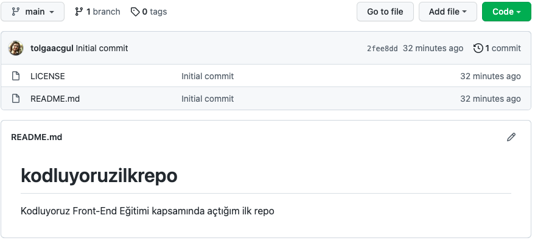

# kodluyoruzilkrepo
Kodluyoruz Front-End Eğitimi kapsamında açtığım ilk repo

# Kofluyoruz Ilk Repo

Bu repo [Kodluyoruz](https://www.kodluyoruz.org/) Front-End Eğitiminde oluşturduğumuz ilk repo. İçerisinde bir adet README.md dosyası, bir adet index.html barındırıyor.



## Installation 

Öncelikle projeyi clonelayın. 

```bash
git clone https://github.com/tolgaacgul/kodluyoruzilkrepo.git
```
## Usage 

Projeyi cloneladıktan sonra Visual Studio Code programında açınız.

Linux için:

```Linux
cd kodluyoruzilkrepo
code .
```

## Contributing

Pull requestler kabul edilir. Büyük değişiklikler için, lütfen önce neyi değiştirmek istediğinizi tartışmak için bir konu açınız.

## License

[MIT](https://choosealicense.com/licenses/mit/)


